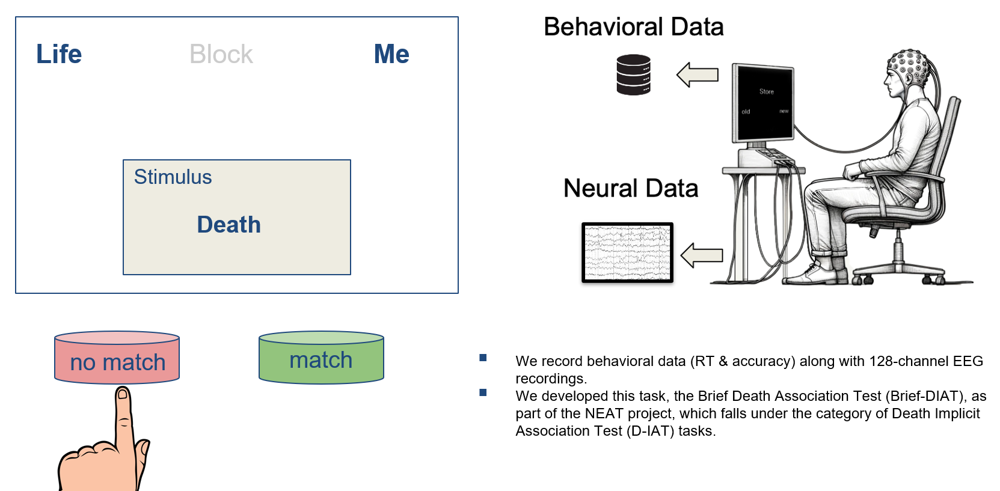

<h2>Data Description</h2>
  

    The dataset used in this study comprises behavioral data collected during an 
    <strong>Implicit Association Task (IAT)</strong> designed to investigate potential 
    behavioral and cognitive differences between individuals with Major Depressive Disorder (MDD) 
    and healthy controls (CTL). The data collection was conducted under IRB approval 
    (<em>Advarra IRB, approved on 01/05/2024</em>). A total of 23 participants' data 
    out of 26 data was used in this research (remaining data were excluded as participants 
    missed more than 200 trials and their performance accuracy was below chance level), 
    including 11 individuals diagnosed with MDD and 12 healthy controls without any reported psychiatric conditions.
  

  

    The experimental task required participants to match a stimulus word with one of two categories 
    displayed as the header on the screen: <strong>"Life + Me"</strong> or <strong>"Death + Me"</strong>. 
    Stimulus words were sequentially presented on the screen, and participants were instructed to press 
    the corresponding button to indicate whether the word matched or did not match the active header. 
    Participants had <code>2.5 seconds</code> to respond, and the task design alternated the header categories 
    every 20 trials to reduce potential response bias and introduce variability. 
    The stimulus words were carefully selected to reflect semantic associations with the task categories. 
    Words such as <em>I, Myself, Alive, Happy</em>, etc., were chosen to correspond to <strong>Life + Me</strong>, 
    while words such as <em>Die, Dead, Lonely, Sad</em>, etc., were chosen to correspond to <strong>Death + Me</strong>.
  

  

    Each participant completed <code>360</code> trials, organized into <code>18</code> blocks, 
    with each block containing <code>20</code> trials. Reaction times (RT) and accuracy were recorded 
    for each trial. In this research, we use RT data to examine the extent to which participant phenotype, 
    <strong>MDD vs. CTL</strong>, is encoded in the RT data.
  

