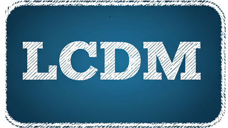

<h1>Latent-state Dynamical Coherence Model (LDCM).</h1>

    Welcome to the <strong>LCDM</strong> repository! This project introduces a novel framework for manifold inference and neural decoding,
    specifically designed for analyzing high-dimensional EEG data collected during a word categorization task. The framework combines
    <strong>state-space models (SSM)</strong> with <strong>deep neural networks (DNN)</strong> to infer latent manifolds and predict task-specific labels
    in a unified and interpretable manner.

<h2>Key Features</h2>
<ul>
    <li><strong>State-Space Modeling with Particle Filters</strong>: Efficient inference of latent states using particle filters to capture the dynamics of high-dimensional neural data.</li>
    <li><strong>Generative-Discriminative Integration</strong>: Combines a generative state evolution model with a discriminative neural network for supervised label prediction.</li>
    <li><strong>1D Convolutional Neural Network (1D CNN)</strong>: Utilizes a 1D CNN to decode latent states into task-specific labels with high precision.</li>
    <li><strong>Expectation-Maximization (EM) Optimization</strong>: Iteratively refines latent states and model parameters for robust manifold inference and label prediction.</li>
    <li><strong>Designed for Cognitive Neuroscience</strong>: Evaluated on EEG data from a word categorization task, distinguishing "Life" vs. "Death" categorizations in participants with and without Major Depressive Disorder (MDD).</li>
</ul>

<h2>Installation</h2>

Clone this repository and install the required dependencies:

<pre><code>git clone https://github.com/&lt;your-username&gt;/lcdm.git
cd lcdm
pip install -r requirements.txt</code></pre>

<h2>Usage</h2>
<ol>
    <li>
        <strong>Prepare Your Data:</strong> Format your EEG data as multi-channel time series. Ensure that it is 
        compatible with the input requirements of the model.
    </li>
    <li>
        <strong>Run the LCDM Model:</strong> Execute the <code>main.py</code> script to infer the latent states 
        and decode task-specific labels:
        <pre><code>python main.py --data_path ./data/eeg_dataset.csv --output_dir ./results</code></pre>
    </li>
    <li>
        <strong>Visualize Results:</strong> Use the provided utilities to analyze and visualize the inferred manifold 
        and decoding performance:
        <pre><code>python visualize.py --results_dir ./results</code></pre>
    </li>
    <li>
        <strong>Run on Google Colab:</strong> Use the pre-configured notebook for an interactive experience: 
        
    </li>
</ol>

<h2>Documentation</h2>

    Comprehensive documentation for LCDM, including API details, examples, and theory, can be found in the <a href="Docs/">docs</a> directory.

<h3>Example: Word Categorization Task</h3>

    We validate our approach using behavioral data recorded during an 
    <em>Implicit Association Test</em> (IAT), where participants classify labels (e.g., MDD vs. CTRL). 
    Our results demonstrate that the framework achieves superior accuracy, sensitivity, and specificity 
    compared to existing methods. This contribution addresses the critical need for approaches that 
    balance interpretability with predictive power, making our framework particularly valuable for 
    analyzing biological and neural data.

Now, you can explore the following code sections to see the framework in action:

<ul>
    <li>
        <strong>Word Categorization Task</strong>: Demonstrates how to apply the LCDM framework to EEG data 
        and visualize the inferred latent manifold.
    </li>
    <li>
        <strong>Latent State Inference</strong>: Showcases the particle filter and EM algorithm in action.
    </li>
    <li>
        <strong>Performance Metrics</strong>: Evaluates model performance using accuracy, ROC curves, and AUC.
    </li>
</ul>

<h2>Citation</h2>

If you use LCDM in your research, please cite us:

<pre><code>@article{lcdm2024,
title={LCDM: Latent Cognitive Dynamical Model for EEG Analysis},
author={Your Name and Collaborators},
journal={arXiv preprint arXiv:XXXX.XXXXX},
year={2024}
}</code></pre>

<h2>Contributing</h2>

We welcome contributions! Please see <a href="CONTRIBUTING.md">CONTRIBUTING.md</a> for guidelines.

<h2>License</h2>

    This project is licensed under the MIT License. See the <a href="LICENSE">LICENSE</a> file for details.

<h2>Acknowledgments</h2>

    This work is inspired by advancements in state-space modeling, deep learning, and neuroscience.
    Special thanks to contributors and researchers in the field of cognitive neuroscience and computational modeling.

