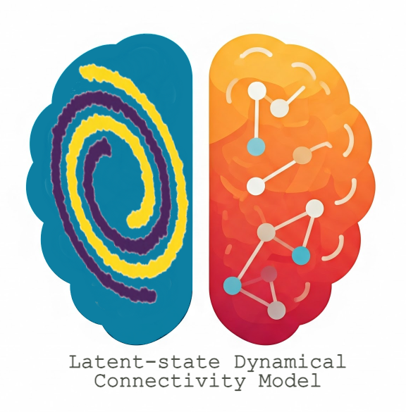

<h1>Latent-state Dynamical Coherence Model (LDCM)</h1>

    <mark>This will be the repository for LDCM project. The material in this repository 
    is based on a current research which combines SSM and DNN for 
    decoding high dimensional neural data. We designed the content of this 
    repository aligned with what we thought it would be for LDCM project. Part of 
    our previous effort on LDCM such as SS-GCoh model and preliminary 
    results on the anesthesia data can be found in our previous GitHub 
    repository developed for this research: (https://github.com/YousefiNeuroLab/SSGCoh)</mark>

    This project introduces a novel 
    framework for manifold inference and neural decoding solution, specifically 
    designed for analysis of high-dimensional data 
    collected during cognitive tasks. In this 
    framework, we combine <strong>state-space models 
    (SSM)</strong> with <strong>deep neural networks (DNN)</strong>, in our effort to characterize 
    high dimensional data, and also infer latent dynamical manifolds, which 
    capture essential dynamics present in data and associated condition or 
    label. For the application, we show the whole modeling pipeline in a 
    Implicit Association Task which is called brief death IAT, recorded in our 
    research group under approved IRB. Details of this task can be found <a href="Data Description.md" target="_blank">here.</a>

<h2>Key Features</h2>

Development of SSM-DNN involves development of multiple modeling 
techniques which include:

<ul>
    <li><strong>MCMC sampling technique ( Particle Filters) for SSM-DNN model:</strong>: Efficient inference solution of latent states, which turns into  particle filters solution deriving an approximate posterior distribution of state given neural data and 
associated labels.</li>
    <li><strong>Data Generation Pipeline</strong>: Generative nature of SSM-DNN model which emerges from its SSM 
element lets us to draw samples (trajectories) of the high dimensional 
data and corresponding labels or categories.</li>
    <li><strong>Flexible DNN Topologies Embedded in SSM-DNN</strong>: The SSM-DNN training and 
inference are agnostic to the DNN topology and structure; thus, we 
demonstrate how model can be applied to Multi-Layer Perceptron Neural Network, CNN with 1-D input and also CNN with multivariate time 
series.</li>
    <li><strong>Verstatile Learning Solution</strong>: Expectation-Maximization (EM) 
based training solution combined with sampling technique and 
stochastic gradient techniques are built for the SSM and DNN model 
training</li>
    <li><strong>Flexibility in Analysis of Different Modalities of Data</strong>: The framework can be applied to different modalities of data 
beyond neural data, and it can process behavioral time-series data or 
mixture of behavioral signals.</li>
</ul>

<h2>Installation</h2>

Clone this repository and install the required dependencies:

<pre><code>git clone https://github.com/&lt;your-username&gt;/ldCm.git
cd ldCm
pip install -r requirements.txt</code></pre>

<h2>How to Use SSM-DNN Package</h2>

To use this toolkit, follow the step-by-step instructions provided below to set up, train, and evaluate the SSM-DNN model for your high-dimensional data analysis tasks.

<ol>
    <li>
        <strong>Prepare Your Data:</strong> Format your data as multi-channel time series. Ensure that it is 
        compatible with the input requirements of the model.
    </li>
    <li>
        <strong>Run the SSM-DNN Model:</strong> Execute the <code>main.py</code> script to infer the latent states 
        and decode task-specific labels:
        <pre><code>python main.py --data_path ./data/eeg_dataset.csv --output_dir ./results</code></pre>
    </li>
    <li>
        <strong>Visualize Results:</strong> Use the provided utilities to analyze and visualize the inferred manifold 
        and decoding performance:
        <pre><code>python visualize.py --results_dir ./results</code></pre>
    </li>
    <li>
        <strong>Run on Google Colab:</strong> Use the pre-configured  for an interactive experience
    </li>
</ol>

<h2>Modeling Approach and Definition</h2>

    Comprehensive documentation for SSM-DNN, including API details, examples, and theory, can be found in the <a href="Docs/">docs</a> directory.

<h2>Dataset Repository</h2>

You will find the dataset used in this research, along with datasets for upcoming work, on the <a href="https://dandiarchive.org/">DANDI archive</a>. The datasets shared on DANDI comply with NIH regulatory guidelines and have been approved by local Institutional Review Boards (IRBs). All datasets have been de-identified to ensure compliance with ethical considerations and HIPAA regulations.

<ul>
    <li><a href="https://dandiarchive.org/dandiset/001285?pos=1 target="_blank> EEG Anesthesia Dataset:</a> This dataset is being recorded as part of the research conducted in this study: <a href="https://www.pnas.org/doi/10.1073/pnas.1017041108">Tracking Brain States under General Anesthesia by Using Global Coherence Analysis</a>. It includes EEG data collected during anesthesia experiments to support the development and evaluation of the proposed models. The dataset adheres to ethical guidelines, with all necessary approvals obtained from relevant Institutional Review Boards (IRBs). The data is de-identified to ensure compliance with privacy standards and HIPAA regulations.</li>
</ul>
    
<h2>Code Examples(Simulation and Real Data Applications)</h2>

<article id="example-2">
<h3>I. Simulated data Classification</h3>

  In this example, we create simulation data replicating SSM-DNN. The model
assumption is as follows:

<ul>
  <li><strong>State Dimension:</strong> 2</li>
  <li><strong>Observation Dimension:</strong> 6</li>
  <li><strong>Number of trials::</strong> 400</li>
  <li><strong>Number of samples per trial:</strong> 25</li>
  <li><strong>Class labels:</strong> 2, Class A and class B</li>
</ul>

The state equation is a multivariate normal followed by Xk+1 = A ⋅ Xk + B + e (we assume A to be an identity matrix and B is vector Zero, and 
epsilon is crrleated noise)

The observation model is defined by Yk = C ⋅ Xk + D

The label for each trial is determined based on the sum of its samples. If the sum of the first half of the samples in a trial is less than the sum of the second half, the label is 0; otherwise, the label is 1.

For DNN, we use a CNN with 2 inputs and 2 convolution layer. The code of this application can be found here:
    <ul>
      <li></li>
      <li> We use MCMC method for the posterior 
estimation of the state (4000 particles) and EM algorithm for training</li>
      <li> We predict DNN probability of 
Class A and Class B using 4000 partcile samples drawn from the satte 
estimation</li>
    </ul>

    
<article id="example-1">
<h3>II. Brief Death Implicit Association Task (BDIAT)</h3>

  Here, we demonstrate an application of SSM-DNN in BDIAT task. For this 
dataset, the observation is RT across 360 trials of task, as describe here. 
There are 23 participants in total, where we know whether the participant 
is from CTL (healthy) or Major Depressive Disorder (MDD) group. We 
consider each participant data as a trial, thus, we have 23 trials in our task 
and the number of sampels per trial is 360. For each trial, the label can 
present either MDD or CTRL group.

The observation dimension is 1, and we use a random walk model as the 
state process. Here, SSM works as adaptive smoother. The DNN is a 1-
dimensional CNN with 2 layer of convoltuin and max-pooling. We use a 
cross-validation scheme to assess prediction accuracy along with sepecificty
and sensvicity of our model. We compared our model with DNN alone, and 
other modeling frameowkr such as XXX and YYY, and found our model can 
reach higher prediction accuracy with a more balanced specificity and 
senisivity.  Different steps of the framework implementation using SSM-
DNN can be found here:

<ul>
    <li><a href="Neural_Network_for_Classification_Task.py">Neural Network for Classification Task</a>: Demonstrates how to implement and train a neural network for EEG data classification and visualize its performance.
    </li>
    <li>
        <a href="LatentStateInference.py">Latent State Inference</a>: Showcases the particle filter and EM algorithm in action.
    </li>
    <li>
        <a href="PerformanceMetrics.py">Performance Metrics</a>: Evaluates model performance using accuracy, ROC curves, and AUC.
    </li>
</ul>
</article>

<h2>Citation</h2>

If you would use SSM-DNN in your research, please cite the following research papers:

<pre><code>@@article{Paper1,
  title = {Novel techniques for neural data analysis},
  author = {Smith, J. and Doe, J.},
  journal = {Google Scholar},
  year = {2023},
  url = {https://scholar.google.com/citations?view_op=view_citation&hl=en&user=M8rzdnwAAAAJ&sortby=pubdate&citation_for_view=M8rzdnwAAAAJ:NXb4pA-qfm4C},
  note = {Accessed: 2025-01-14}
}
@article{Paper2,
  title = {Advances in deep learning for neuroscience},
  author = {Brown, A. and Taylor, K.},
  journal = {Google Scholar},
  year = {2022},
  url = {https://scholar.google.com/citations?view_op=view_citation&hl=en&user=jieyeRUAAAAJ&sortby=pubdate&citation_for_view=jieyeRUAAAAJ:NDuN12AVoxsC},
  note = {Accessed: 2025-01-14}
}
@article{Paper3,
  title = {State-space models in neuroscience},
  author = {Doe, J. and Smith, R.},
  journal = {PubMed},
  year = {2020},
  url = {https://pubmed.ncbi.nlm.nih.gov/31947169/},
  note = {Accessed: 2025-01-14}
}</code></pre>

<h2>Collaboration and Contribution</h2>

We welcome your contribution in this research! Please check <a href="Contribution.md">here</a> for guidelines.

<h2>License</h2>

    This project is licensed under the MIT License. See the <a href="License">lincense</a> file for details.

<h2>Acknowledgments</h2>

    This work was partially supported by the Defense Advanced Research Projects Agency (DARPA) under cooperative agreement #N660012324016. The content of this information does not necessarily reflect the position or policy of the Government, and no official endorsement should be inferred. We appreciate our research collaborators from UMN, Intheon, and others. This work was also supported by startup funds from the University of Houston. Special thanks go to our research collaborators and colleagues who contributed by providing data and offering thoughtful comments to refine our modeling framework.

